# HARDWARE

This guide describes how to connect the Adafruit Feather M0 Adalogger to the SparkFun F9P and F9R boards to create a F9P_RAWX_Logger or a F9R_RAWX_Logger

## Adafruit Feather M0 Adalogger

The [Adafruit Feather M0 Adalogger](https://www.adafruit.com/product/2796) is a versatile board equipped with a SAMD21G18A ARM Cortex-M0+
microcontroller (as used on the Arduino Zero), a micro-SD card socket and a LiPo battery charger.

The present design doesn't allow to take advantage of battery capabilities of the board ([see issue1](https://github.com/Eric-FR/F9x_RAWX_Logger/issues/1)).
Developpements under way (2024-2025...).

Choose a good quality micro-SD card. A 4GB card should provide more than enough storage for your RAWX files, at least with F9P. Make sure the card is formatted
as FAT32. If you have problems formatting the card, you might need to download and use the official SD card formatter from the
[SD Association](https://www.sdcard.org/downloads/formatter/index.html). Insert the card into the Adalogger before connecting USB. **Don't insert or remove the card while power is connected!**

There are many ways to hook up the Adalogger. The simplest is to use header pins and jumper wires. There are full instructions
available on the [Adafruit website](https://learn.adafruit.com/adafruit-feather-m0-adalogger/assembly).

## SparkFun GPS-RTK2 Board

The [SparkFun GPS-RTK2 Board](https://www.sparkfun.com/products/15136) is equipped with the 
[u-blox ZED-F9P](https://www.u-blox.com/en/product/zed-f9p-module) GNSS module.

The u-blox ZED-F9P is a sophisticated dual band (L1 + L2) GNSS receiver which can act as a Real Time Kinematic base or rover. It has a variety of interfaces:
2 UART, SPI, I2C and USB. SparkFun have included their Qwiic I2C connectors on the board, making it easy to interface it to their other Qwiic boards.
For the RAWX_Logger we will be using the I2C interface for configuration and the UART1 interface for data transfer.

The main goal of this project is to log RAWX messages which can be post-processed (PPK) using [rtklibexplorer's](https://rtklibexplorer.wordpress.com/) version of
[RTKLIB](http://rtkexplorer.com/downloads/rtklib-code/). Indeed, some NMEA messages are also recorded in Rover mode.
RTK capability of F9P can be used by receiving RTCM corrections on UART2. UART2 can also send RTCM corrections in base mode.

Like the Adalogger, there are many ways to hook up the F9P board. Again, the simplest is to use header pins and jumper wires.

## SparkFun GPS-RTK DR Board

The [SparkFun GPS-RTK Dead Reckoning Breakout](https://www.sparkfun.com/products/16344) is equipped with the [u-blox ZED-F9R](https://www.u-blox.com/en/product/zed-f9r-module)
a GNSS module combined with an IMU.

The u-blox ZED-F9R is a sophisticated dual band (L1 + L2) GNSS receiver including an Inertial Measurement Unit (IMU). The GNSS part can act as a Real Time Kinematic rover.
The IMU includes 3 accelerometers and 3 gyroscopes. It can also receive wheel tick contact (and direction contact). Wheel tick or vehicule speed may also be sent by software. 
It has same interfaces as F9P plus wheel tick and direction contacts.

Although the main goal of this project is to log GNSS RAW messages and IMU RAW messages, we are not aware of a current free software that can perform post-processing of this combination.
Some NMEA messages are also recorded. RTK capability of F9R can be used by receiving RTCM corrections on UART2. IMU calibration and alignement should take advantage of RTK.

Like the F9P board, there are many ways to hook up the F9R board. Again, the simplest is to use header pins and jumper wires.


## HC-05 BT module

The HC-05 is a Bluetooth (v2.0) module [compatible with Arduino](https://howtomechatronics.com/tutorials/arduino/arduino-and-hc-05-bluetooth-module-tutorial/).
Although many modeles ara available online, they don't all provide equally stable BT connection.
We recommand [DSD](https://www.amazon.fr/DSD-TECH-HC-05-Pass-through-Communication/dp/B01G9KSAF6) or [Az-Delivery](https://www.az-delivery.de/en/products/hc-05-6-pin).

The HC-05 need to be configured prior to use, mostly for baud rate (to 115200).
One can use an [Arduino board](https://www.instructables.com/Change-the-Baud-Rate-of-HC-05-Bluetooth-Module-Usi/) or an [USB-TTL cable](https://www.amazon.fr/FT232RL-Serial-Arduino-C%C3%A2ble-Modulo/dp/B075XK737D).

Pins are included in HC-05 modules.

## Connections

Connect the following pins:

- Adalogger GND to SparkFun GND
- Adalogger USB (VBUS) to SparkFun 5V
- Adalogger RX (D0) to SparkFun TX/MISO
- Adalogger TX (D1) to SparkFun RX/MOSI
- Adalogger SDA to SparkFun SDA
- Adalogger SCL to SparkFun SCL
- HC-05 GND to SparkFun GND
- HC-05 VCC to SparkFun 3V3
- HC-05 TXD to SparkFun RX2
- HC-05 RXD to SparkFun TX2


SparkFun boards have their own 3.3V regulator on board. We will use this and power it from the Adalogger VBUS pin. 

These connections will also work if you want to power the Adalogger using the USB-C socket on the SparkFun board.

**Be careful that you do not connect power via the Adalogger USB and SparkFun USB-C sockets at the same time. BAD THINGS WILL HAPPEN IF YOU DO!**


Connect the SparkFun board to a suitable **active** L1/L2 GNSS antenna using the uFL socket. You may need to use a [uFL to SMA adapter](https://www.sparkfun.com/products/9145).

## F9P: Rover and Base Mode

Connect the Adalogger A0 pin to GND to put the logger into base mode. Leave A0 floating for rover mode. The only differences between base and rover mode are:
- The RAWX log filenames will start with "r_" for the rover and "b_" for the base
- The F9P navigation engine dynamic model is set to "Portable(default)" for the rover and "stationary" for the base
- (The dynamic models can be changed by editing the Arduino code)

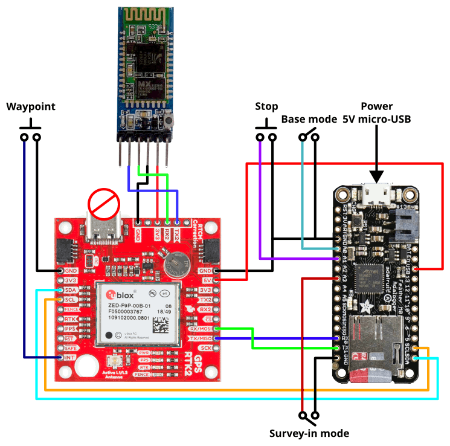

The logger also supports Survey_In mode where the ZED-F9P calculates its own position and then generates RTCM 3 correction messages on the UART2 TX2 pin.
If you want to use Survey_In, connect pin A3 to GND. You will need to have A0 connected to ground too. The green LED will flash (or the NeoPixel will turn magenta)
when the ZED-F9P has established a TIME solution. The RTCM messages are output at 115200 Baud.

## F9R: Fusion Engine and Classical Mode

Connect the Adalogger A0 pin to GND to turn off the High precision sensor fusion (HPS). Leave A0 floating to turn on HPS. 
"HPS allow high-accuracy positioning in places with poor or no GNSS coverage. HPS is based on sensor fusion" between GNSS and IMU.

HPS is supported in 3 dynamic models: Automotive, E-scooter and Robotic lawn mower.

With HPS, the F9R navigation engine dynamic model is set to "Automotive". Without HPS, it is set "Portable(default)".
(The dynamic models can be changed by editing the Arduino code)

Without HPS, raw IMU data are still logged. 

With HPS and Automotive, auto-alignement is activated (can be desactivated by editing the Arduino code).
Once "fine" alignement is reached, alignement parameters are stored in the µSD card in a align.txt file at root, as follow:
```
fine
1.04
-11.91
357.42
```
At next startup, if pin A3 is not connected to GND, alignement parameters will be read from the file and used for IMU orientation. 
This will allows a much faster activation of the Fusion Engine.

If pin A3 is connected to GND at startup, auto-alignement is restrated (or just remove from the µSD the existing align.txt file).

You can also provide an equivalent file (incl. the 1<sup>st</sup> line with "fine" followed by roll, pitch and yaw) to provide IMU orientation for E-scooter and Robotic lawn mower. 

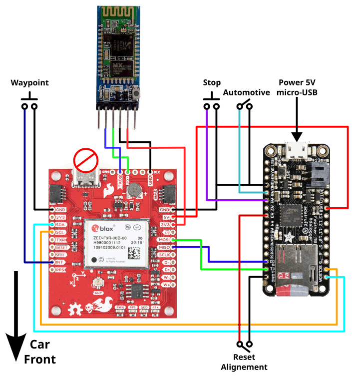

## Stopping the Logger

You need to connect a "stop logging" push switch between the Adalogger A1 pin and GND. Pushing this switch will safely close the RAWX log file so you can
unplug the power. If you unplug USB while the logger is still logging, the RAWX log file will not get closed and you will lose your current data (last 15 minutes)!

## Waypoint / Timestamp Event

You can connect a push switch between GND and the SparkFun INT pin. Pushing it will generate a TIM_TM2 message which will get logged with the RAWX data.
[RTKLIB](https://rtklibexplorer.wordpress.com/2018/10/26/event-logging-with-rtklib-and-the-u-blox-m8t-receiver/) can be used to export these events.

Instead of a switch, you can connect the INT pin to a 3.3V logic signal from (e.g.) your UAV camera trigger. (The signal must be between 0V and 3.3V.
Higher voltages will cause permanent damage to the F9P/F9R!)

## PCB

We (courtesy of [buched](https://github.com/buched)) provide two PCB designs, one for each chip/board. [Gerber file format](https://en.wikipedia.org/wiki/Gerber_format).

[PCB for F9P](ressources/Gerber_F9P_logger.zip).

[PCB for F9R](ressources/Gerber_F9R_logger.zip).

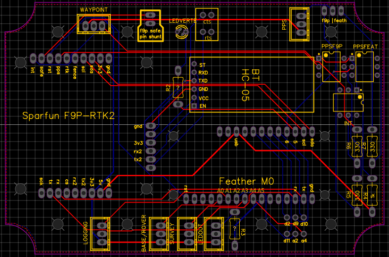

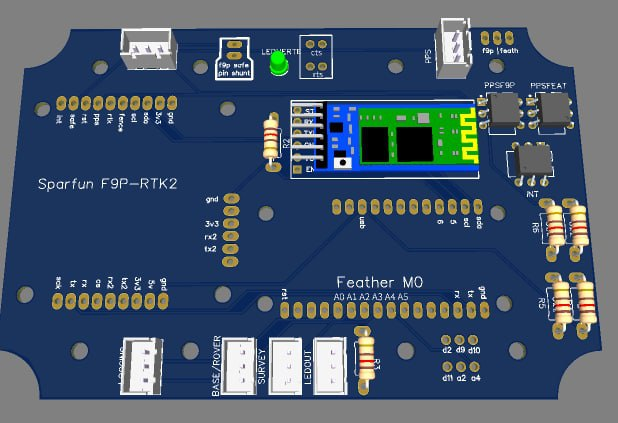

## Casing

Using [Hammond RP1135C](https://www.hammfg.com/part/RP1135C) enclosure (with transparent cover to see LEDs). IP65.

An [USB cable](https://www.amazon.fr/gp/product/B07ZCZ8NL1/ref=ppx_yo_dt_b_asin_title_o03_s00?ie=UTF8&psc=1) to connect the feather board to the outer part of the enclosure.

To allow the several external connexions and easy access to the SD card, all boards should not be at the same level.
This can be done with [stacking headers](https://www.adafruit.com/product/2886), a single row for the F9P/F9R and two rows for the feather board.

F9P stacking:

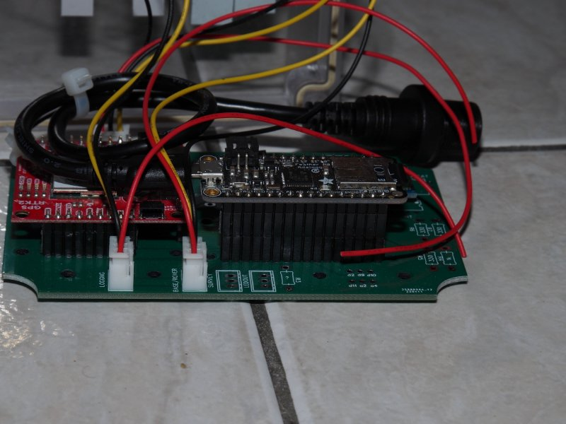

F9R stacking:

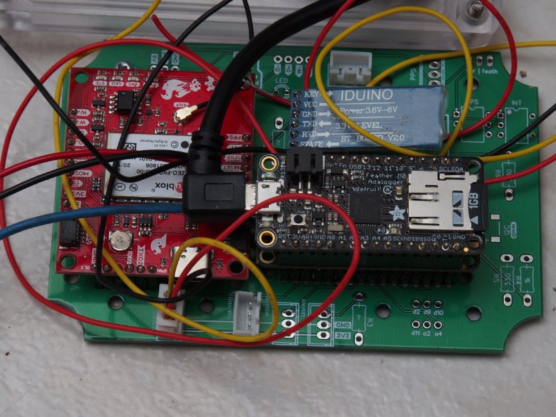

F9R stacking is including the [Adafruit CAN Bus FeatherWing - MCP2515](https://www.adafruit.com/product/5709) for connexion with car OBD
(with DB9 connector and OBD Plug (16-pin) to DE-9 (DB-9) Socket Adapter Cable](https://www.adafruit.com/product/4841)) in order to get  tick count or speed from car.
Under developpement.

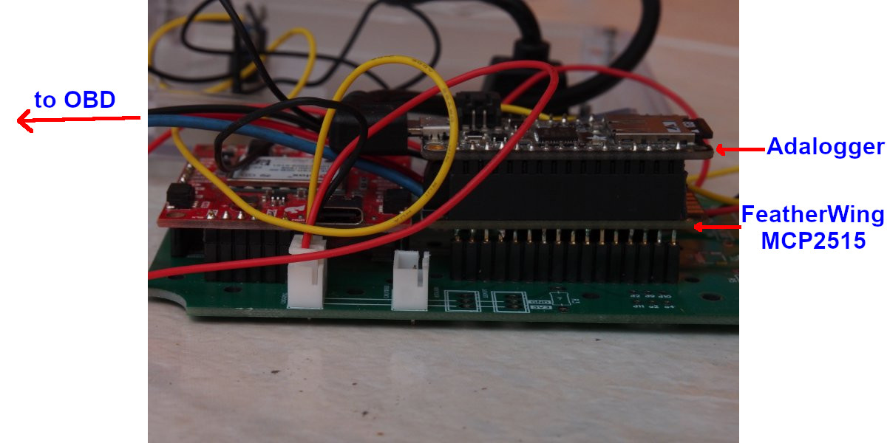

Inside the box:

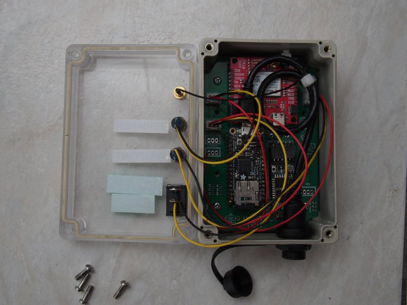

Final state:

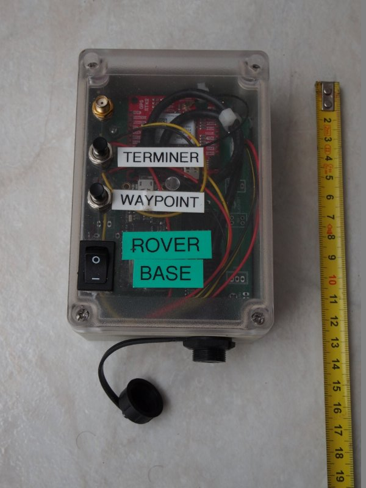


## Testing

Connect the Adalogger to your computer using a micro-USB cable. The logger will draw its power from the USB port.

Open the Arduino IDE (tested with 1.8.19) and open the RAWX_Logger_F9x.ino sketch. Modify the code to choose F9P or F9R, depending on the board you ar using:
```
#define F9P // Comment this line out to use F9P 
or
#define F9R // Comment this line out to use F9R 
```
Check the Tools\Board and Tools\Port settings. Upload the code to the Adalogger using the arrow icon below the Edit menu.

As soon as the upload is finished, click on the Tools menu and then "Serial Monitor". Change the baud rate to 115200 using the pull-down menu
at the bottom of the serial monitor window. All being well, after 10 seconds you should see messages saying (for F9P):

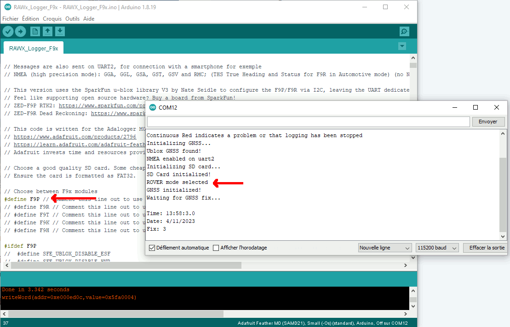

For F9R

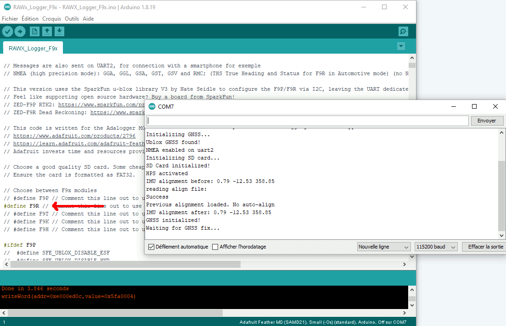

The green LED on the Adalogger will light up when a GNSS fix is established and the logger is about to start logging RAWX data. If the LED doesn't illuminate
after ~1 minute, check the antenna has a clear view of the sky. There are DEBUG messages that you can enable to help diagnose problems. The messages will
appear in the serial monitor. Uncomment the line which says:

```
#define DEBUG // Comment this line out to disable debug messages
```

and upload the code again.

The red LED on the Adalogger will flash quickly each time data is written to the SD card. Continuous red indicates: a problem with the SD card; or that the
stop switch has been pressed; or that the LiPo battery is low.

The logger will keep logging until the stop switch is pressed. A new file is opened every 15 minutes to minimise data
loss if the power is accidentially disconnected. The INTERVAL can be changed by editing the Arduino code. If you disconnect the power while the log file is
still open, you will lose your data (the file will appear zero size).

Disconnect the power before removing the SD card. Plug the SD card into your computer using a suitable adapter and look for the RAWX log file(s). You will find them
in a directory called "YYYYMMDD" where YYYY is the UTC year, MM is the month and DD is the date. A rover file will be called "r_HHMMSS.ubx" where HH is the UTC hour,
MM the minute and SS the second when the file was _created_. Base files start with "b_".

You can concatenate the separate log files into one contiguous file without losing any data:

In Windows:
- Copy the RAWX files from the SD card into a normal Documents folder
- Open a cmd prompt (type cmd into the search box on the toolbar and hit enter)
- cd (change directory) into the Documents folder
- Use the following command to concatenate all the rover UBX RAWX files into a single file
- copy /b r_*.ubx rover.ubx
- Likewise, this command will concatenate the base files into a single file
- copy /b b_*.ubx base.ubx

In Linux:
- cat r_*.ubx > rover.ubx
- cat b_*.ubx > base.ubx

The HHMMSS filename format ensures that the files are concatenated in the correct order. If your files straddle UTC midnight, you will have to combine the files
from day1 and day2 separately first and then combine the two day files together.

You can then process a pair of base and rover files using [RTKLIB](http://rtkexplorer.com/downloads/rtklib-code/).


## Next > [UBX.md](https://github.com/PaulZC/F9P_RAWX_Logger/blob/master/UBX.md)


