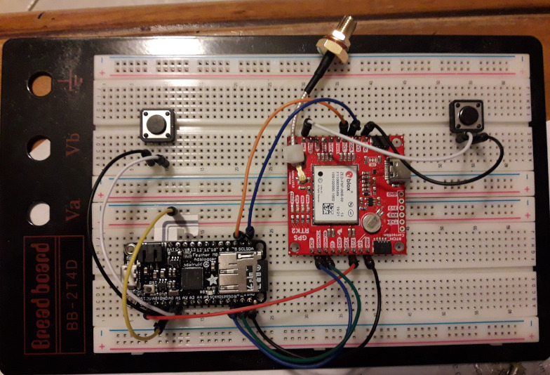

# F9x_RAWX_Logger

A guide on how to assemble a GNSS PPK RAWX Logger from an [Adafruit Feather M0 Adalogger](https://www.adafruit.com/product/2796)
and, ever a [SparkFun GPS-RTK2 Board](https://www.sparkfun.com/products/15136) which incorporates the [u-blox ZED-F9P](https://www.u-blox.com/en/product/zed-f9p-module)
dual band (L1 + L2) GNSS receiver or a [SparkFun GPS-RTK Dead Reckoning Breakout](https://www.sparkfun.com/products/16344) which incorporates the [u-blox ZED-F9R](https://www.u-blox.com/en/product/zed-f9r-module)
dual band (L1 + L2) GNSS receiver with integrated IMU.

The RAWX files logged by this project can be processed using [rtklibexplorer's](https://rtklibexplorer.wordpress.com/)
version of [RTKLIB](http://rtkexplorer.com/downloads/rtklib-code/)

[SOFTWARE.md](SOFTWARE.md) describes how to install the Arduino IDE and
all the libraries you will need for this project

[HARDWARE.md](HARDWARE.md) describes how to connect the Adalogger to the
SparkFun boards

[UBX.md](UBX.md) describes how the Arduino code communicates with
the F9P using the u-blox UBX binary protocol to enable and log the RAWX messages

The [Arduino](Arduino) directory contains the Arduino code.

## Licence

This project is distributed under a Creative Commons Attribution + Share-alike (BY-SA) licence.
Please refer to section 5 of the licence for the "Disclaimer of Warranties and Limitation of Liability".

Enjoy!

**_Paul_**

